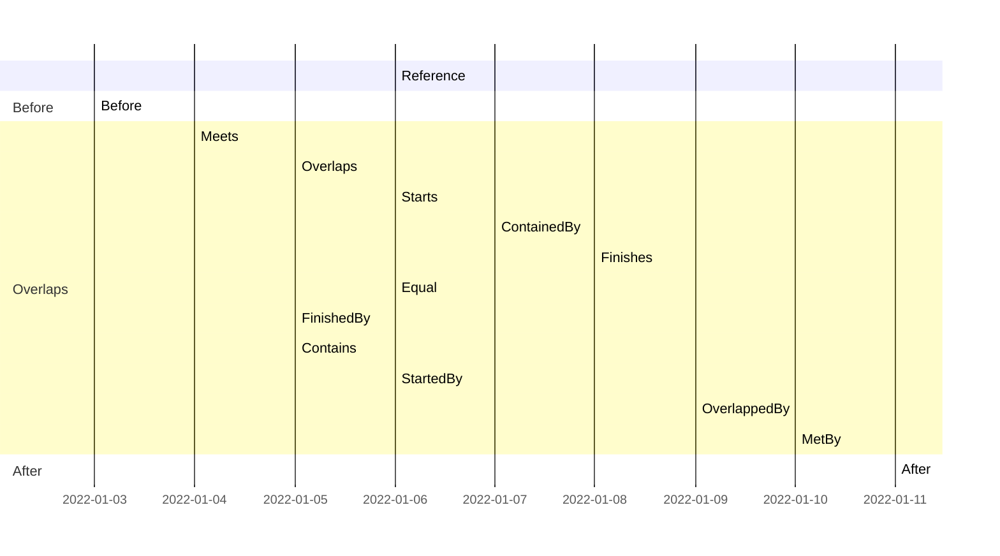

# IntervalRecords
An **IntervalRecord** is an immutable record struct named **Interval** which represents an Interval of values of a given type. The record type was introduced in C# 9.0 and the main reason that this type is used is because the **with** statement will make it easy to use immutable objects. **IntervalRecords** is using the [InfinityComparable](https://github.com/viclang/InfinityComparable/) package for support of Unbounded, LeftBounded and RightBounded intervals.

**IntervalRecords** will help you to create, canonicalize, compare, combine, measure, iterate and parse all the different types of intervals. It implements the interval comparison based on the interval overlapping relation that was described by the [IEEE Interval Standard Working Group](https://grouper.ieee.org/groups/1788/PositionPapers/overlapping.pdf).

### Download & Install
**Nuget Package [IntervalRecords](https://www.nuget.org/packages/IntervalRecords/)**

```powershell
Install-Package IntervalRecords
```
Minimum Requirements: .NET 6.0

### Supported types
The following interval types are supported by type specific extension methods:
- `Interval<int>`
- `Interval<double>`
- `Interval<DateTime>`
- `Interval<DateTimeOffset>`
- `Interval<DateOnly>`
- `Interval<TimeOnly>`

### Interval Overlapping Relations 
The **GetIntervalOverlapping** extension method will calculate the overlapping relation between two intervals. This gantt chart will show you all the possible IntervalOverlapping relations compared to the reference interval:

