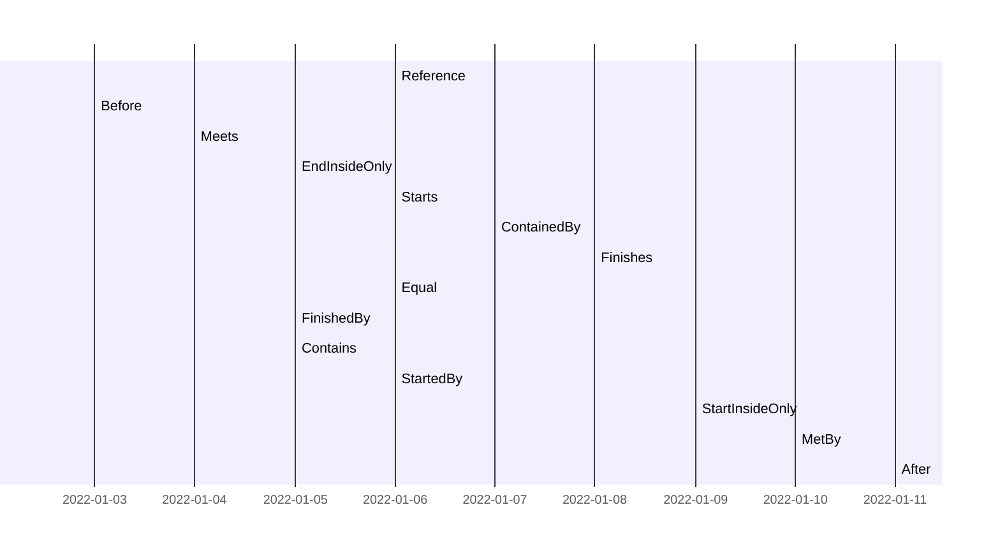

# IntervalRecord
The record Interval<T> will make it easy to deal with https://en.wikipedia.org/wiki/Interval_(mathematics). If you have a validity period you no longer need to figure out the exact business logic.

The interval supports Closed, ClosedOpen, OpenClosed and Open boundaryTypes.
