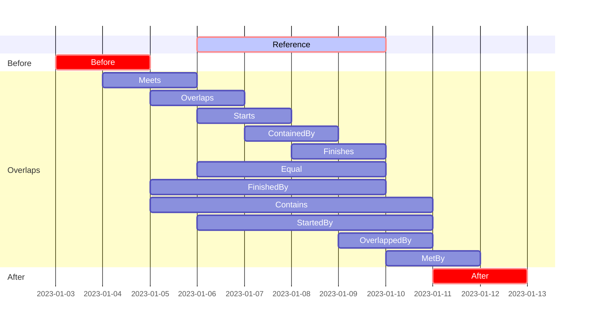

# IntervalSet
An Interval is an immutable record class named **Interval** which represents an Interval of values of a given type. The [record class](https://learn.microsoft.com/en-us/dotnet/csharp/language-reference/builtin-types/record) type was introduced in C# 9 and the main reason that this type is used is because the [with expressions](https://learn.microsoft.com/en-us/dotnet/csharp/language-reference/builtin-types/record#with-expressions-in-derived-records) will make it easy to use immutable objects.

**IntervalSet** will help you to create, canonicalize, compare, combine, measure, iterate and parse all the different types of intervals. It implements the interval comparison based on the interval overlapping relation that was described by the [IEEE Interval Standard Working Group](https://grouper.ieee.org/groups/1788/PositionPapers/overlapping.pdf).

### Download & Install
**Nuget Package [IntervalSet](https://www.nuget.org/packages/IntervalSet/)**

```powershell
Install-Package IntervalSet
```
Minimum Requirements: .NET 8.0

### Supported types
The following interval types are supported by type specific extension methods:
- `Interval<int>`
- `Interval<double>`
- `Interval<DateTime>`
- `Interval<DateTimeOffset>`
- `Interval<DateOnly>`
- `Interval<TimeOnly>`

### Interval Overlapping Relations 
The **GetIntervalOverlapping** extension method will calculate the overlapping relation between two intervals. This gantt chart will show you all the possible IntervalOverlapping relations compared to the reference interval:

